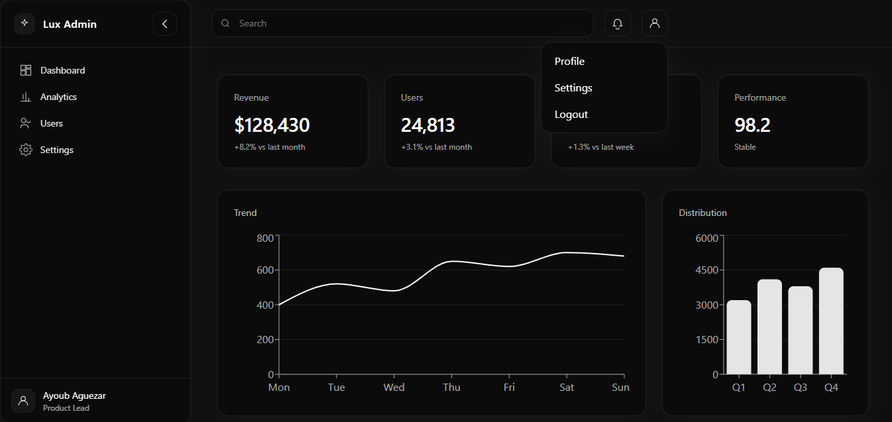

  

&nbsp;&nbsp;&nbsp;

&nbsp;&nbsp;&nbsp;

&nbsp;&nbsp;&nbsp;

&nbsp;&nbsp;&nbsp;

  

🖤 Black Admin Dashboard
========================

A modern, fully responsive dark SaaS dashboard built with **React (Vite + TypeScript)** and **Tailwind CSS**.  
Designed with a strict black & white aesthetic for a clean, premium, and enterprise-ready interface.

* * *

🚀 Tech Stack
-------------

| Icon | Technology | Role |
|------|------------|------|
|  | **React** | UI library for building interactive components |
|  | **Vite** | Fast development server and build tool |
|  | **TypeScript** | Static typing for scalable and maintainable code |
|  | **Tailwind CSS** | Utility-first CSS framework for styling |
|  | **Vercel** | Deployment and hosting platform |
| 📊 | **Recharts** | Data visualization library for charts |

* * *

✨ Features
----------

*   Fully responsive layout
    
*   Collapsible & sticky sidebar (desktop)
    
*   Mobile sliding sidebar
    
*   Top navbar with search & profile menu
    
*   KPI cards
    
*   Line & Bar charts (Recharts)
    
*   Dark data table
    
*   Progress bars
    
*   Smooth animations & hover effects
    
*   Reusable component architecture
    

* * *

📂 Project Structure
--------------------

    d:\dash
    ├─ index.html
    ├─ package.json
    ├─ tailwind.config.js
    ├─ vite.config.ts
    ├─ vercel.json
    └─ src
       ├─ App.tsx
       ├─ main.tsx
       ├─ index.css
       ├─ components
       │  ├─ Charts.tsx
       │  ├─ DataTable.tsx
       │  ├─ KPICard.tsx
       │  ├─ Layout.tsx
       │  ├─ Navbar.tsx
       │  ├─ ProgressBar.tsx
       │  └─ Sidebar.tsx
       ├─ data
       │  └─ mock.ts
       └─ pages
          └─ Dashboard.tsx
    

* * *

🛠 Installation
---------------

### 1️⃣ Clone the repository

    git clone https://github.com/your-username/black-admin-dashboard.git
    cd black-admin-dashboard
    

### 2️⃣ Install dependencies

    npm install
    

### 3️⃣ Run development server

    npm run dev
    

App runs on:

    http://localhost:5173
    

* * *

📦 NPM Scripts
--------------

| Command | Description |
|----------|------------|
| `npm run dev` | Start development server |
| `npm run build` | Build production files |
| `npm run preview` | Preview production build |
| `npm run typecheck` | Check TypeScript types |

* * *

🎨 Design System
----------------

| Element | Color |
|----------|--------|
| Background | `#0f0f0f` |
| Card | `#111111` |
| Border | `#1f1f1f` |
| Primary Text | `#ffffff` |
| Secondary Text | `#a1a1aa` |

* * *

🌐 Live Demo
------------

[https://black-admin-dashboard.vercel.app/](https://black-admin-dashboard.vercel.app/)

* * *

📄 License
----------

MIT License – Free to use and modify.

* * *

